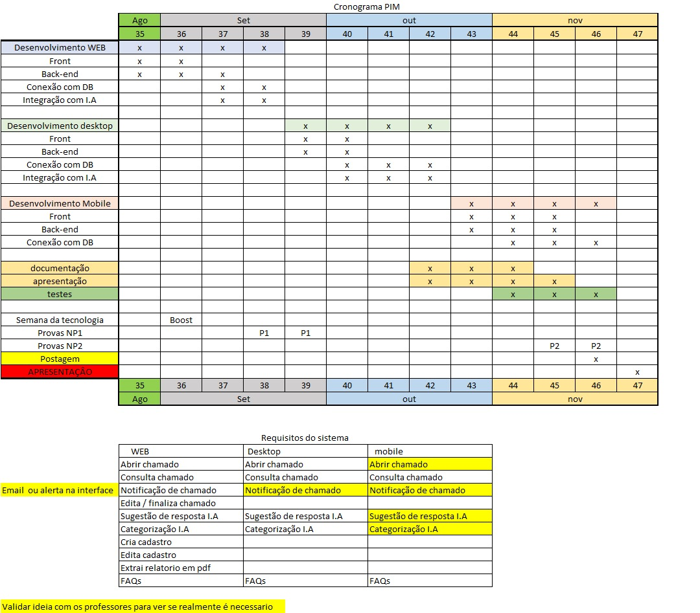

# HelpDesk - Revolucionando o Suporte Técnico com Inteligência Artificial

_Soluções integradas de suporte técnico com IA para empresas que buscam eficiência e organização._

---

## Descrição do Desafio
O desafio proposto foi criar um sistema de chamado para setores empresariai(setor TI, administrativo e etc...) com integração e priorização e encaminhamento automatico sem precisar do contato humano assim otimizando o tempo e podendo focar somente no chamado para resolve-lo mais rapido possivel, nosso projeto conta com uma API feita em C# e um (frontend) e integração com ia que sera responsavel por propor soluções no momento da abertura do chamado, caso não seja resolvida a pendencia ela ira encaminhar para o setor responsavel. O armazenamento sera feito em SqlServer hospedado em nuvem e tendo disponibilidade multiplataforma assim sendo web, mobile, desktop.
## Backlog do Produto
[Clique aqui para acessar o backlog](https://github.com/users/JSRubioo/projects/2)

## Cronograma de Evolução do Projeto

## Tabela Descritiva das Sprints
| Período da Sprint | Link para a Documentação da Sprint | Data de entrega | 
|-------------------|------------------------------------| -----------------|
| Sprint 1          | [Elaboar Documentação inicial do github](#) | 26/08/2025|
| Sprint 2          | [Desenvolvimento Front](#) | 05/09/2025|

## Tecnologias Utilizadas
- Backend feito em C#
- (frontend)
- SqlServer em nuvem
- Gemini IA

## 📞 Contato e Carreira

- **Comercial:** [Jonas Santos Rubio](https://github.com/JSRubioo)    
- **Imprensa:** [Breno Sacilotti](https://github.com/acreditar)    
- **Trabalhe conosco:** [João Gabriel de Oliveira](https://github.com/dev-joaogabriel)    
- **FeedBack:** [Rodrigo Oliveira](https://github.com/devRODS)
---

> **HelpDesk** — "Atendimento que entende você."
